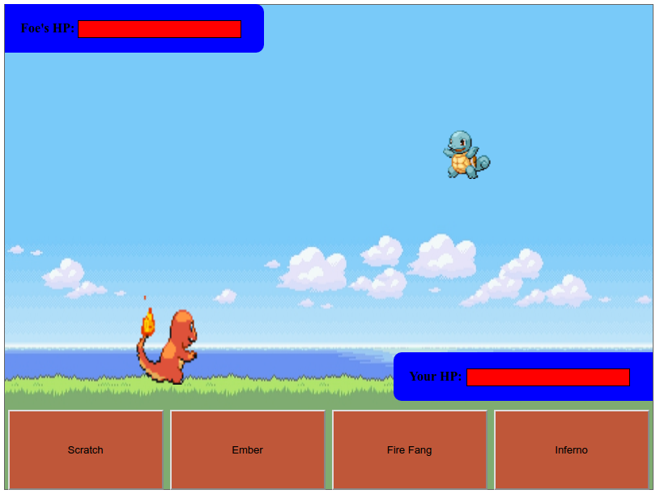

# Poke Battle JS

## Background

Poke Battle JS is a turn-based Pokemon style battling game involving three starter pokemon as
the choice of characters. Pokemon are part of a popular kids cartoon involving monsters that train and evolve.

There will be various types associated with the pokemon as well as different attacks.

## Functionality & MVP

With Poke Battle JS, the user will be able to:

* Select the character they would like to battle with
* Select from a variety of moves to use
* Involve engaging animations and sounds
* Battle against an ai

The user at character select will be able to choose from the three characters (Charmander, Squirtle, or Bulbasaur).
The battle screen then will involve sprites for different characters and moves along with 4 move options.

## Architecture and technologies

The project will be implemented using the following technologies:

* Vanilla JS and jquery for game logic
* HTML5 with canvas for DOM manipulation and rendering
* Webpack

The game will have the following files:

* monster.js to handle the character information
* attack.js to handle the logic behind attacks
* game.js to handle the turns and battle logic

## Aspects

The game presents a nostalgic relation to the original game boy games released by Nintendo with classic animations and sounds.
